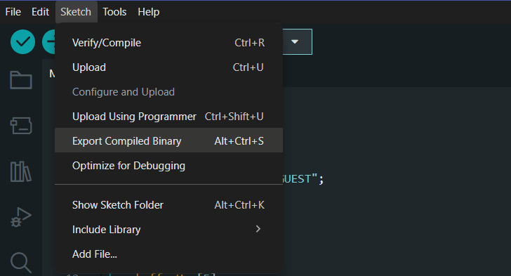
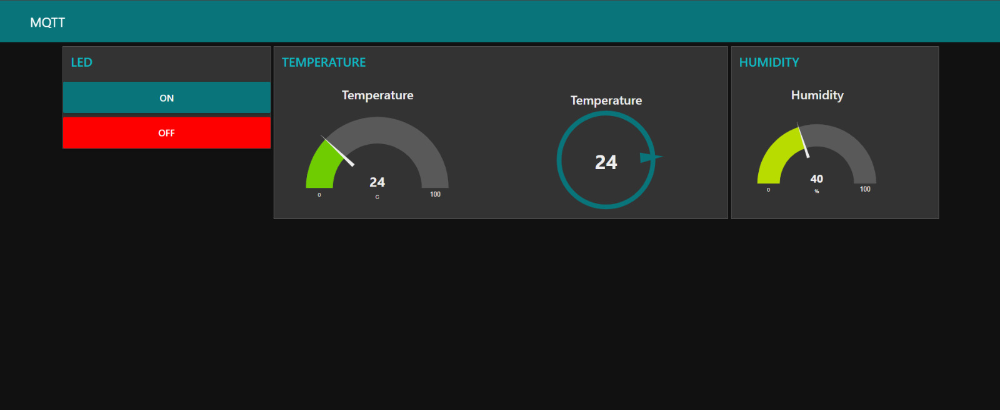
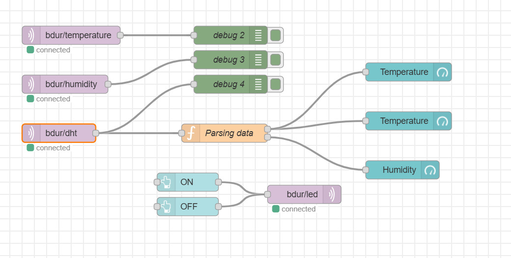

# IoT Temperature & Humidity Monitoring with MQTT & Node-RED

Proyek ini merupakan sistem pemantauan suhu dan kelembapan berbasis IoT menggunakan sensor **DHT22** dan mikrokontroler **ESP32**. Data dikirimkan melalui protokol **MQTT** ke broker **EMQX** dan divisualisasikan menggunakan dashboard **Node-RED**. Proyek ini disimulasikan sepenuhnya pada platform **Wokwi** menggunakan metode upload file binary (.bin).

---

## 🚀 Features
* **Real-time Monitoring**: Membaca data lingkungan (suhu & kelembapan) secara akurat dari sensor DHT22.
* **Dual Format Data**: Mengirim data dalam bentuk String tunggal dan format JSON untuk fleksibilitas integrasi.
* **Remote Actuator Control**: Mengendalikan lampu LED dari jarak jauh melalui dashboard (ON/OFF).
* **Interactive Dashboard**: Visualisasi interaktif menggunakan Gauge dan Chart pada Node-RED Dashboard.

---

## 🛠️ Hardware Requirements (Simulated)
Penyusunan komponen pada simulasi Wokwi menggunakan pinout berikut:

| Hardware | ESP32 Pin | Function |
| :--- | :--- | :--- |
| **DHT22 Sensor** | GPIO 14 | Data Input |
| **LED** | GPIO 2 | Digital Output |
| **VCC** | 3.3V | Power Supply |
| **GND** | GND | Ground |

<figure>
  
  <figcaption align="center"><i>Skema rangkaian ESP32 dengan DHT22 dan LED di Wokwi.</i></figcaption>
</figure>

---

## 📂 Project Documentation (Full Details)
Untuk panduan teknis yang lebih mendalam mengenai konfigurasi, skema wiring, dan cara kerja sistem, silakan unduh file PDF berikut:

👉 **[Download Dokumentasi Lengkap (PDF)](docs/Dokumentasi_Proyek_IoT.pdf)**

---

## ⚙️ How to Generate Binary File (.bin)
Untuk menjalankan simulasi di Wokwi dengan metode upload binary tanpa membagikan kode sumber, ikuti langkah-langkah di Arduino IDE:

1. Buka file `.ino` proyek Anda.
2. Atur board ke **ESP32 Dev Module**.
3. Pilih menu **Sketch** > **Export Compiled Binary**.
4. Cari file berakhiran `.bin` di folder proyek Anda (biasanya di dalam folder `build`)[cite: 1, 2].
5. Di Wokwi, tekan tombol **F1**, pilih **"Upload Compiled Binary (.bin) / HEX File"**, dan pilih file tersebut.

<figure>
  
  <figcaption align="center"><i>Proses pembuatan file binary di Arduino IDE.</i></figcaption>
</figure>

---

## 📊 Node-RED Installation & Operation

### 1. Menjalankan Node-RED
Pastikan Node-RED sudah terinstal di sistem Anda. Ikuti langkah berikut untuk memulai:
*   **Jalankan Node-RED**: Ketik perintah di bawah ini pada terminal atau command prompt:
    ```bash
    node-red
    ```
*   **Akses Editor**: Buka browser dan akses editor di: [http://localhost:1880](http://localhost:1880).

### 2. Dashboard Integration & MQTT Topics
Sistem mengirimkan data ke topic MQTT dalam format JSON. Node-RED kemudian melakukan parsing data tersebut untuk ditampilkan ke dashboard.

**MQTT Topics:**
*   `bdur/dht`: Payload JSON (Suhu & Kelembapan).
*   `bdur/led`: Perintah Kontrol lampu (1=ON, 0=OFF).
*   `bdur/temperature`: Data suhu (String).
*   `bdur/humidity`: Data kelembapan (String).

**Operation Steps:**
1.  **Instal Dashboard**: Instal `node-red-dashboard` melalui menu **Manage Palette** > **Install**.
2.  **Import Flow**: Import flow JSON proyek ini ke Node-RED.
3.  **Konfigurasi MQTT**: Hubungkan node MQTT ke broker `broker.emqx.io` pada port `1883`[cite: 1].
4.  **Deploy**: Klik tombol **Deploy** di pojok kanan atas editor.
5.  **Akses UI**: Akses antarmuka dashboard melalui browser di alamat: [http://localhost:1880/ui](http://localhost:1880/ui).

<figure>
  
  
  <figcaption align="center"><i>Tampilan Dashboard Monitoring dan Logika Flow pada Node-RED.</i></figcaption>
</figure>

---

## 👨‍💻 Author
**Abdurrahman Bantaniy**
*   IoT Engineer & Educator
*   Bogor, Indonesia