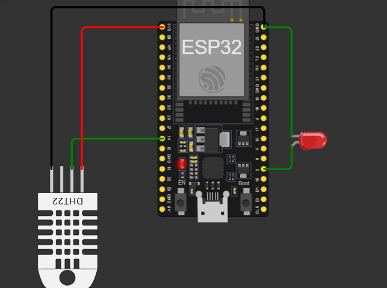

# IoT Temperature & Humidity Monitoring with MQTT & Node-RED

Proyek ini mendemonstrasikan sistem monitoring suhu dan kelembapan menggunakan sensor **DHT22** dan kontrol **LED** secara remote melalui protokol komunikasi **MQTT**. Proyek ini disimulasikan menggunakan **Wokwi** dengan metode upload program menggunakan **Binary File (.bin)**.

---

## 🚀 Fitur Utama
* **Monitoring Real-time**: Membaca data suhu dan kelembapan dari sensor DHT22.
* **Protokol MQTT**: Mengirimkan data dalam format string tunggal dan format JSON ke broker EMQX.
* **Kontrol LED**: Mengendalikan status LED (ON/OFF) melalui dashboard Node-RED.
* **Dashboard Node-RED**: Visualisasi data menggunakan gauge dan chart yang interaktif.
---

## 🛠️ Skema Wiring (Simulasi Wokwi)
Penyusunan komponen pada ESP32 dilakukan sebagai berikut:

| Komponen | Pin ESP32 | Keterangan |
| :--- | :--- | :--- |
| **DHT22 (Data)** | GPIO 14 | Input Sensor |
| **LED (Anoda)** | GPIO 2 | Output Kontrol |
| **VCC** | 3.3V | Catu Daya |
| **GND** | GND | Ground |

*Tata letak komponen pada simulator Wokwi.*

---

## 📂 Dokumentasi Lengkap (PDF)
Untuk penjelasan mendalam mengenai langkah-langkah teknis, silakan unduh dokumen berikut:

👉 **[Download Dokumentasi_Proyek_IoT.pdf](docs/Dokumentasi_Proyek_IoT.pdf)**

---

## ⚙️ Cara Membuat Binary File (.bin)
Untuk menjalankan simulasi di Wokwi tanpa kode sumber, ikuti langkah ini di Arduino IDE:

1.  Buka file sketsa (`.ino`).
2.  Pilih board: **Tools** > **Board** > **ESP32** > **ESP32 Dev Module**.
3.  Klik menu **Sketch** > **Export Compiled Binary**.
4.  File `.bin` akan muncul di folder proyek Anda (biasanya di dalam folder `build`).

*Proses export binary di Arduino IDE.*

---

## 📊 Integrasi Node-RED
Sistem mengirimkan data ke topic `bdur/dht` dalam format JSON. Node-RED kemudian melakukan *parsing* data untuk ditampilkan pada dashboard.

**Topic MQTT:**
* `bdur/temperature`: Data suhu (String)
* `bdur/humidity`: Data kelembapan (String)
* `bdur/dht`: Data suhu & kelembapan (JSON)
* `bdur/led`: Kontrol lampu (1=ON, 0=OFF)

*Tampilan dashboard monitoring dan flow Node-RED.*

---

## 👨‍💻 Author
**Abdurrahman**
*   IoT Engineer & Educator
*   Bogor, Indonesia
